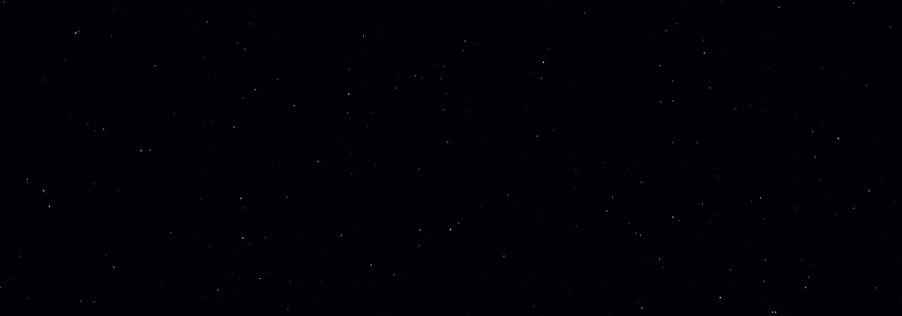

# Starfield Visualization

This project creates a starfield effect using JavaScript. The stars animate across the canvas, making it perfect for creating dynamic and visually engaging backgrounds.




## Quick Start Guide

To run this project locally, follow these steps:

1. **Clone the Repository**:

   ```
   git clone <url>
   cd starfield-visualization
   ```

2. **Open the Project**:

   Locate the `index.html` file in the project directory and double-click it to open it in your default web browser. The starfield animation will start immediately.

## Customization ([params.js](params.js))

You can customize the appearance and behavior of the starfield by modifying `params.js`.

- `BG_COLOR`: Background color of the canvas in hexadecimal format.

- `NUM_STARS`: Number of stars to be generated in the starfield.

- `MAX_SIZE`: Maximum size of a star.

### Star's Lifecycle

Every star has a _**lifecycleThe**_ through which it loops through, which is how the starfield effect is achieved.

- `MAX_SPEED`: Maximum speed at which the stars can move. 

- `MIN_DURATION`: Minimum duration of a star's animation cycle, in seconds.

- `MAX_DURATION`: Maximum duration of a star's animation cycle, in seconds.

### Parallax

To add depth, larger stars move faster since they appear to be closer. The next two parameters allow you to tweak this behavior.

- `MAX_PARALLAX_SPEED_MODIF`: Maximum amount of speed that can be gained by being larger

- `PARALLAX_SPEED_CHANGE_RATE`: The rate at which the parallax speed changes based on the star size.


## Project Structure

- `assets/`: Assets for README's project demo.
- `index.html`: Main HTML file.
- `index.css`: Main CSS file.
- `index.js`: Renders starfield.
- `points.js`: Contains helper functions for 2D vectors.
- `canvas.js`: Container for canvas functionality.